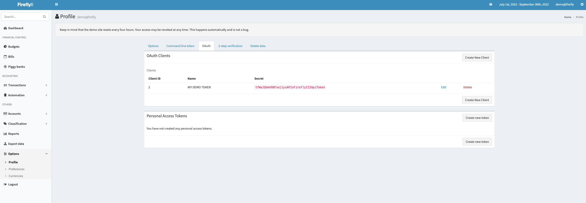
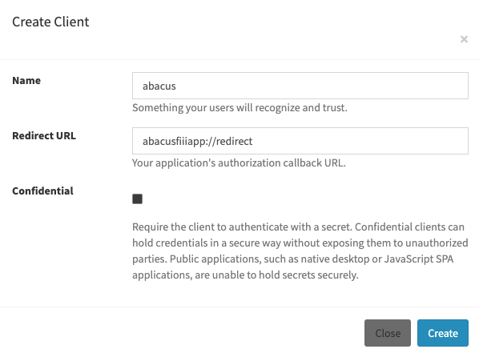

## How to log and connect to your Firefly III instance?

### If you're using an external authentication provider like Authelia, OAuth Clients will not work. You can use Personal Access Tokens only.

1. Go to `/profile` 
2. Create a new Oauth client with redirect URI: `abacusfiiiapp://redirect`

3. Copy and paste `Oauth Client ID` it will be a number (required, Example: `4`).

4. No need to use the secret client but if you do so copy and paste it in the `Oauth Client Secret` field.

### Personal Access Token

create:

copy:

paste:

