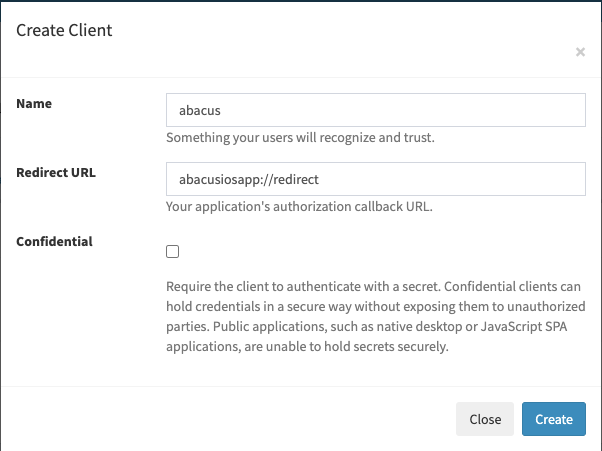

## How to log and connect to your Firefly III instance?

1. Go to `/profile` 
2. Create a new Oauth client with redirect URI: `abacusiosapp://redirect`

3. Copy and paste `Oauth Client ID` it will be a number (required, Example: `4`).

4. No need to use the secret client but if you do so copy and paste it in the `Oauth Client Secret` field.

