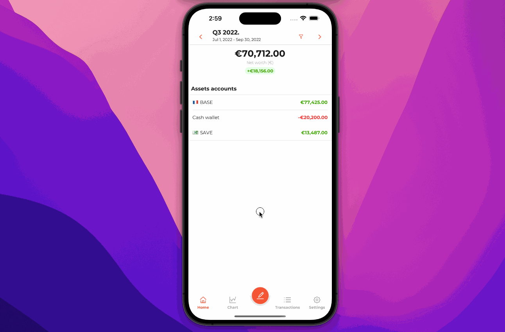

    

  
  <h1>Abacus: Firefly III mobile application</h1>
    

        
    

  

  
  

  

  

---

### 🎙 Introduction

[Firefly III](https://github.com/firefly-iii/firefly-iii) mobile application to manage your self-hosted Firefly III from
your mobile.

Support for iPhone, iPad, Android Phone and Android Tablet.

On iOS, Tokens are stored in [**iOS Keychains**](https://developer.apple.com/documentation/security/keychain_services).

On Android, Tokens are stored in [SharedPreferences](https://developer.android.com/training/data-storage/shared-preferences), encrypted with [Android's Keystore system](https://developer.android.com/training/articles/keystore.html).

No external API calls nor Analytics API, not even sentry / crashlytics.

---

### 📱 Features

| Feature                      | Available |
|------------------------------|:---------:|
| Oauth2 authentication        |     ✅     |
| Asset accounts history chart |     ✅     | 
| Transactions (create, list)  |     ✅     |
| Net worth                    |     ✅     |
| Balance                      |     ✅     |
| Earned                       |     ✅     |
| Time range selector          |     ✅     |
| Budgets                      |     ✅     |
| Categories                   |     ✅     |
| Translations                 |   ✅(@carvalholeo)    |

---

### 📡 Technologies

- __Expo SDK 48__ Framework and a Platform for universal React applications. [docs.expo.io](https://docs.expo.io/)
- __Routing and navigation__ React Navigation
  V6. [https://reactnavigation.org/docs](https://reactnavigation.org/docs/getting-started)
- __Redux architecture__
    - Rematch core [@rematch/core](https://github.com/rematch/rematch)
    - Rematch plugin [@rematch/loading](https://rematchjs.org/docs/plugins/loading)
    - Rematch persist [@rematch/persist](https://rematchjs.org/docs/plugins/persist)
- __UX/UI Library__
    - Native Base [https://nativebase.io](https://nativebase.io/)
- __Linting__
    - Airbnb's Linting : [https://github.com/airbnb/javascript](https://github.com/airbnb/javascript)
- __Splash Screen Animated__
    - React Native Splash Screen : [npmjs](https://www.npmjs.com/package/react-native-animated-splash-screen)

---

### 📖 Docs

- [Contributing to this project](.github/CONTRIBUTING.md)
- [Understanding the file structure](documentation/file.md)
- [ReactNative.dev](https://reactnative.dev)
